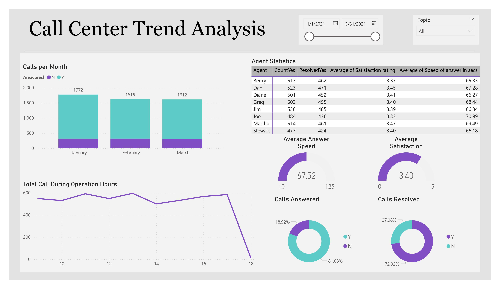

# PwC_Power-BI_Virtual_experience

We aim to build innovative technology solutions that differentiate us from our competitors and digitise the business. Part of that included a strategic decision to invest in upskilling programmes so our people could learn how to use digital tools for data visualisation as well as automation, data cleansing and more.

If our people could use these tools to solve common problems, they’d help us become more efficient and growth-oriented now and more innovative later in Business Services and beyond. Now, employees are learning to build bots – over 2,400 have been created so far – to automate workflows. We continue to invest to make processes more intuitive using machine learning, PowerBI and eventually artificial intelligence (AI). These are key to working faster and solving problems differently for ourselves and our clients.

This is why you're here! Our Digital Accelerator programme is an internal chance that takes groups of our employees out of their day jobs and puts them through  trainings that teaches them skills in technology such as automation, machine learning, design thinking, and digital storytelling. PowerBI is an important part of it as visualising data helps to handle and understand clients.

## Task 1: Call Centre Trends
Create a dashboard in Power BI for Claire that reflects all relevant Key Performance Indicators (KPIs) and metrics in the dataset. Get creative! 

**Possible KPIs include (to get you started, but not limited to):**
- Overall customer satisfaction
- Overall calls answered/abandoned
- Calls by time
- Average speed of answer
- Agent’s performance quadrant -> average handle time (talk duration) vs calls answered

## Task 2: Customer Retention
A few weeks after presenting your dashboard to the management, the Retention Manager from the telecom reaches out to you directly. He was impressed by your work and asked if you can put together a dashboard about customer retention.

In addition, to better understand the data, the telecom Retention Manager has scheduled a meeting with the engagement partner at PwC to cover these points:
- Customers in the telecom industry are hard-earned: we don’t want to lose them
- The retention department is here to get customers back in case of termination 
- Currently, we get in touch after they have terminated the contract, but this is reactionary: it would be better to know in advance who is at risk 
- We have done customer analysis with Excel: it has always ended in a dead-end
- We would like to know more about our customers: visualised clearly so that it’s self-explanatory for our management
The Retentions Manager has provided some information, have a look through the resource section.

